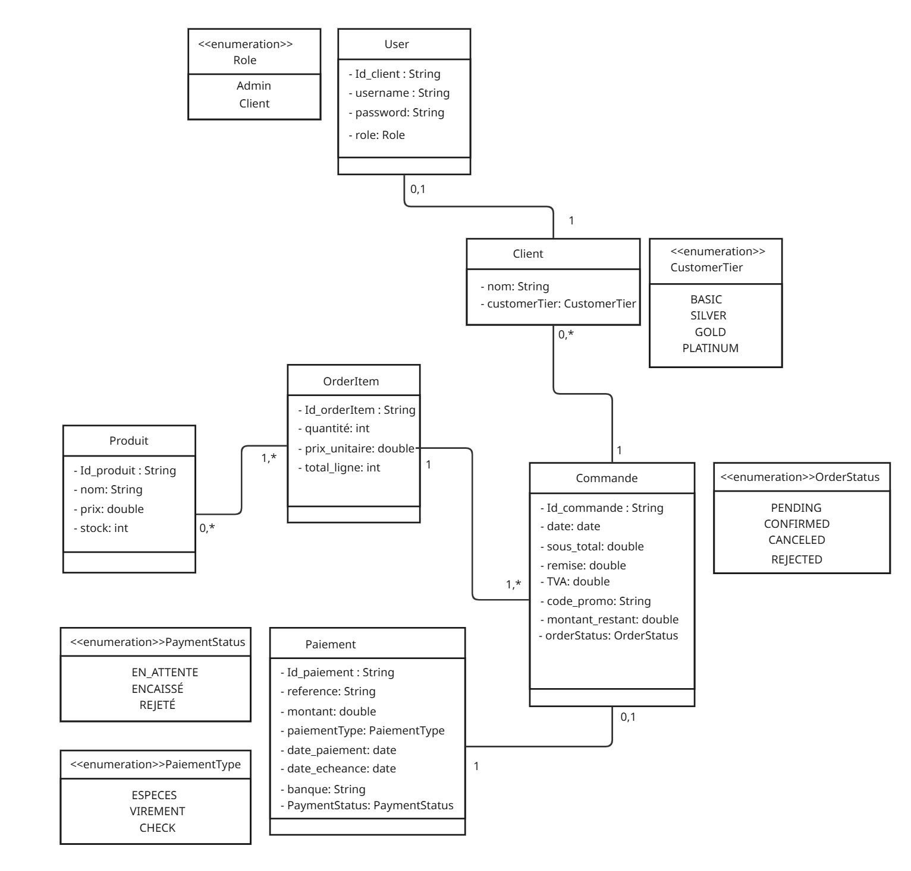

#  SmartShop – Backend REST API

**Gestion commerciale pour MicroTech Maroc**

---

## 📌 Contexte

**SmartShop** est une application backend REST (sans interface graphique) conçue pour MicroTech Maroc, distributeur B2B basé à Casablanca.
Elle permet de gérer :

* 650+ clients actifs
* Un système de fidélité automatique
* Un module de commandes multi-produits
* Un système de paiements fractionnés multi-moyens
* Une traçabilité complète des événements financiers

✔ API uniquement
✔ Authentification via **HTTP Session** (pas de JWT, pas de Spring Security)
✔ Tests via Postman / Swagger


# 🚀 Fonctionnalités principales

### 👤 1. Gestion des Clients

* CRUD complet
* Statistiques automatiques :

    * Nombre total de commandes
    * Montant cumulé (commandes confirmées)
    * Première / dernière commande
* Historique détaillé des commandes
* Niveau de fidélité calculé automatiquement

---

### 🏆 2. Système de Fidélité

| Niveau   | Condition n°1 | Condition n°2 | Remise          |
| -------- | ------------- | ------------- | --------------- |
| BASIC    | défaut        | —             | 0%              |
| SILVER   | ≥3 commandes  | ou ≥1000 DH   | 5% si ≥500 DH   |
| GOLD     | ≥10 commandes | ou ≥5000 DH   | 10% si ≥800 DH  |
| PLATINUM | ≥20 commandes | ou ≥15000 DH  | 15% si ≥1200 DH |

La remise s’applique **sur les futures commandes**, avant TVA.

---

### 📦 3. Gestion des Produits

* Ajout / mise à jour / suppression
* Soft delete si produit déjà utilisé
* Liste filtrée + pagination
* Validation du stock

---

### 🧾 4. Gestion des Commandes

* Commandes multi-produits
* Vérification du stock
* Remises cumulées :
  ✔ Fidélité
  ✔ Code promo PROMO-XXXX
* Calcul automatique :

    * Sous-total HT
    * Montant remise
    * Total HT après remise
    * TVA 20%
    * Total TTC
* Statuts : PENDING / CONFIRMED / CANCELED / REJECTED
* Mise à jour automatique des statistiques client
* Décrémentation du stock

---

### 💰 5. Paiements Multi-Moyens

Moyens acceptés :

* **Espèces** (≤20.000 DH)
* **Chèque** (échéance + banque + statut)
* **Virement** (référence + banque)

✔ Une commande peut être payée en plusieurs fois
✔ Tant que montant_restant > 0 → statut = **PENDING**
✔ Une commande ne peut être **CONFIRMÉE** que si **totalement payée**

---


### Design Patterns utilisés

* Layered Architecture
* DTO Pattern
* Builder (Lombok)
* Mapper Pattern (MapStruct)
* Exception Handling centralisé (@ControllerAdvice)

---

# 🔧 Stack technique

| Technologie        | Usage                    |
| ------------------ | ------------------------ |
| **Java 17+**       | Langage principal        |
| **Spring Boot**    | Framework backend        |
| Spring Web         | API REST                 |
| Spring Data JPA    | ORM                      |
| PostgreSQL         | Base de données          |
| Lombok             | Réduction du boilerplate |
| MapStruct          | Mapping DTO ↔ Entity     |
| JUnit / Mockito    | Tests unitaires          |
| HTTP Session       | Authentification         |

---

# 🗄 Modèle de données (Entities principales)

* **User**
  id, username, password, role (ADMIN / CLIENT)

* **Client**
  id, nom, email, stats, fidélité, historique…

* **Product**
  id, nom, prix, stock, softDelete

* **Order (Commande)**
  id, client, items, statut, montants, code promo, montant restant…

* **OrderItem**
  id, produit, quantité, total ligne

* **Payment**
  id, type, montant, date, date_encaissement, statut (EN_ATTENTE / ENCAISSÉ / REJETÉ)

Enums :
`UserRole`, `OrderStatus`, `PaymentStatus`, `CustomerTier`

---

# ⚙ Installation & Exécution

### 1️⃣ Cloner le projet

```bash
git clone https://github.com/amhine/SmartShop.git
cd SmartShop
```

### 2️⃣ Lancer l’application

```bash
mvn spring-boot:run
```

---

# 🔗 Endpoints API (Résumé)

### Authentification (Session)

| Méthode | URL     | Rôle | Fonction       |
| ------- | ------- | ---- | -------------- |
| POST    | /login  | ALL  | Login session  |
| POST    | /logout | ALL  | Logout session |

---

### Clients

CRUD complet + statistiques + historique.

---

### Produits

CRUD + soft delete + pagination.

---

### Commandes

Créer → Calcul → Paiements → Validation.

---

### Paiements

Ajouter différents paiements jusqu’à couvrir le total TTC.


---

# 💳 Gestion des paiements (Workflow)

1. Création paiement → statut selon type
2. Recalcul montant restant
3. Si montant restant == 0 → commande confirmable
4. ADMIN valide la commande → statut CONFIRMED

---

# ❗ Gestion des erreurs

Gérée via `@ControllerAdvice`.

| Code | Signification   |
| ---- | --------------- |
| 400  | Validation      |
| 401  | Non authentifié |
| 403  | Accès refusé    |
| 404  | Non trouvé      |
| 422  | Règle métier    |
| 500  | Interne         |

---

## la diagramme des classes
